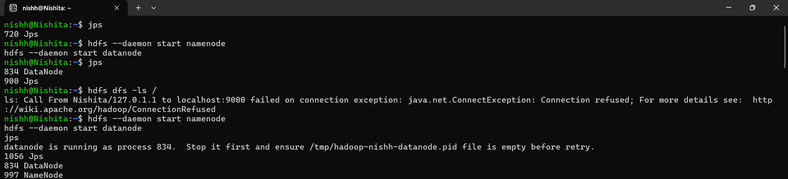

# Cloud SaaS using HDFS

## Description
This project simulates a cloud storage system using HDFS over a LAN.

## Features
- File upload and download using HDFS
- File storage in distributed blocks
- Basic cloud controller concept
- Secure data handling (encryption concept)

## Technologies Used
- HDFS (Hadoop)
- Linux

## Workflow
1. Start Hadoop services
2. Create directory in HDFS
3. Upload file
4. Retrieve file

## Architecture
This project simulates a cloud environment over LAN using HDFS.

## Key Concepts
- Distributed Storage
- Data Blocks
- Fault Tolerance

## Skills Gained
- HDFS usage
- Linux commands
- Cloud basics

## Screenshots

### Upload File

### Output

## Commands Used
Refer to commands.txt file

## Output
Successfully uploaded and retrieved files from HDFS cloud

## Author
Nishita Pawar 